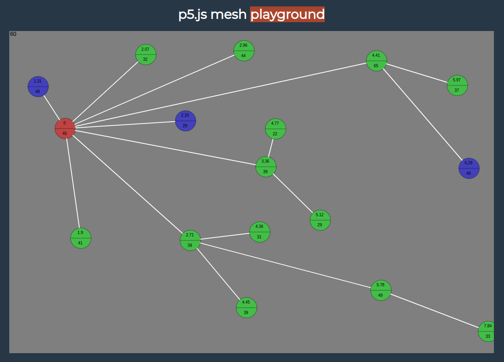

# Mesh Router

Mesh routing simulation with [p5.js](https://p5js.org/) and [Typescript](https://www.typescriptlang.org/)

Uses a simplification of [Expected Transmission Count (ETX)](https://en.wikipedia.org/wiki/Expected_transmission_count) for calculating the optimal routing.

Not a real life simulation, just a playground.

<p>
  
</p>

## Usage

```bash
docker-compose -f docker-compose.yml up --build
```

or
```bash
npm install
npm start
```

## License
[MIT](https://choosealicense.com/licenses/mit/)

## References

[p5.js library](https://p5js.org/)
[Typescript](https://www.typescriptlang.org/)
